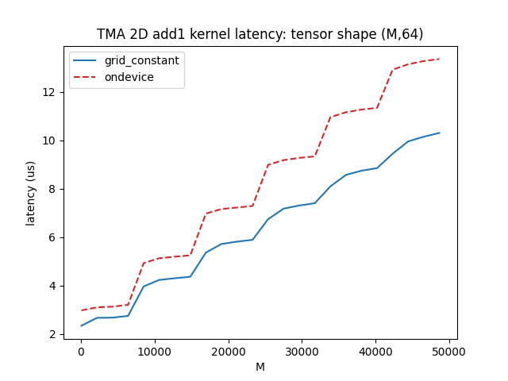

# tma-micro-bench

```
sudo dnf install cuda-toolkit-12-4
export CUDA_HOME=/usr/local/cuda-12.4/
export TORCH_CUDA_ARCH_LIST="9.0a"
python setup.py develop
python test.py
python benchmark.py
```

Note: `test.py` is currently broken so that NVIDIA folks can repro the bug I'm seeing with cpfence. `benchmark.py` does not use the broken function. Please comment the last line of `test.py` if you just want to make pretty charts.


